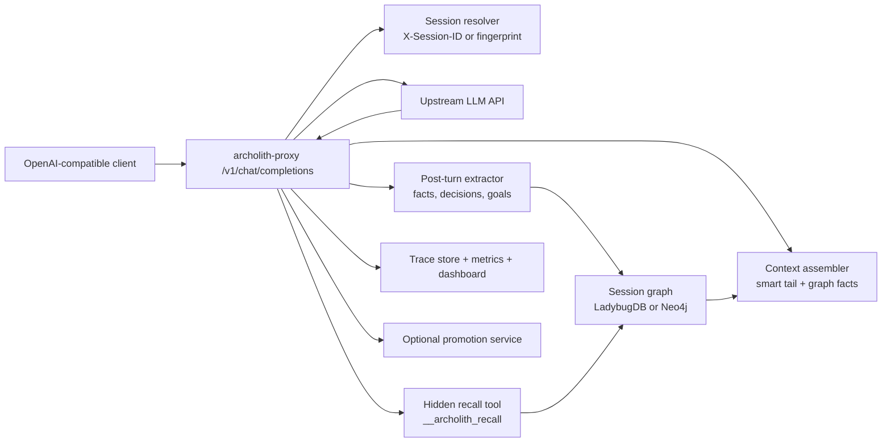

# archolith-proxy Architecture

This document describes how `archolith-proxy` works today, based on the current repository state.

## Overview

`archolith-proxy` is a FastAPI service that exposes an OpenAI-compatible surface, proxies requests to an upstream model, and gradually replaces raw replayed conversation history with session-local graph context.

The core idea is:

1. keep the system prompt
2. keep a recent coherence tail
3. extract durable knowledge from each turn
4. rebuild the middle of the conversation from graph facts instead of resending every prior message

## System Diagram

## Major Components

| Component | Responsibility |
|-----------|----------------|
| `archolith_proxy/main.py` | App lifecycle, backend initialization, health/admin surfaces, router mounting |
| `archolith_proxy/openai/chat.py` | Main chat completions flow, assembly, streaming, recall interception, extraction kickoff |
| `archolith_proxy/proxy/session.py` | Session ID resolution and fingerprint-based session fallback |
| `archolith_proxy/proxy/rewrite.py` | Message rewriting and system-prompt merge |
| `archolith_proxy/assembler/context.py` | Fact ranking, context assembly, token budgeting, retrieval heuristics |
| `archolith_proxy/assembler/tail.py` | Smart coherence-tail preservation, including tool-call integrity handling |
| `archolith_proxy/proxy/tool_injection.py` | Hidden recall-tool injection, stripping, and result handling |
| `archolith_proxy/graph/*` | Graph backend protocol plus LadybugDB and Neo4j implementations |
| `archolith_proxy/trace/*` | In-memory turn traces, graph inspection endpoints, extraction QA endpoint |
| `archolith_proxy/memory/*` | Optional long-term memory promotion registry and adapters |

## Request Lifecycle

### 1. Incoming Request

The primary public surface is `/v1/chat/completions`.

The proxy also exposes:

- `/v1/models`
- pass-through routes under `/v1/*`
- `/live`, `/ready`, and legacy `/health`
- `/metrics`
- `/sessions*` and `/trace*` operator surfaces
- `/ws/stream` for live event streaming
- `/dashboard/dashboard.html` for the static dashboard

### 2. Session Resolution

Before assembly or extraction, the proxy resolves a session:

- preferred: `X-Session-ID`
- fallback: SHA-256 of a sanitized system prompt plus first user message, truncated to 16 chars

The sanitization step strips volatile date/time and tool-definition details so the fingerprint stays stable across repeated calls.

### 3. Assembly Eligibility

Before rewriting, the proxy estimates input tokens using `tiktoken` `cl100k_base` with a 10% margin and a minimum floor of 500 tokens.

Assembly can be skipped for several reasons:

- cold start: not enough history yet
- graph unavailable
- input size below `ASSEMBLY_MIN_INPUT_TOKENS`
- estimated savings ratio below `ASSEMBLY_MIN_SAVINGS_RATIO`
- assembly latency budget exceeded

### 4. Context Retrieval and Ranking

If graph mode is active, the assembler retrieves active facts for the session and ranks them.

Without embeddings:

- fact type priority: 40%
- confidence: 30%
- recency: 30%

With embeddings:

- semantic similarity: 40%
- recency: 30%
- type/confidence blend: 30%

When embeddings are enabled, the assembler also uses an adjacent-turn context window so related facts from neighboring turns can survive selection.

### 5. Context Rendering

The assembled context is rendered in two sections:

- `SESSION OVERVIEW`
- `RELEVANT CONTEXT`

The resulting block includes goal, touched files, decisions, fact count, and ranked facts.

### 6. Message Rewriting

The proxy preserves:

- the original system prompt
- a recent coherence tail
- tool-call integrity for tail messages

It drops the replay-heavy middle and merges the assembled graph context into the original system message. This merge is deliberate: some upstream providers reject consecutive system messages.

### 7. Upstream Call

The rewritten request is forwarded to the configured upstream base URL. The proxy injects the server-side `UPSTREAM_API_KEY` into outbound requests.

### 8. Recall Tool Interception

If `SESSION_RECALL_TOOL_ENABLED=true`, the proxy injects a hidden `__archolith_recall` tool.

If the model calls it:

1. the proxy intercepts the tool call
2. optionally rewrites the recall query for clarity
3. optionally embeds the query
4. queries active session facts
5. formats a bounded tool result
6. replays the request upstream with that tool result inserted

The synthetic tool is stripped back out before the user-facing response returns.

Streaming requests follow the same logic, but the proxy buffers the stream long enough to detect and handle recall before resuming SSE output.

### 9. Post-Response Extraction

After the response returns, the proxy asynchronously extracts structured knowledge and writes it back to the graph.

Current fact types include:

- `file_state`
- `error`
- `tool_result`
- `decision`
- `state`
- `goal`
- `observation`

The extractor also updates:

- session goal
- file touch metadata
- decisions
- invalidations / supersession when applicable

## Graph Backends

### LadybugDB

LadybugDB is the embedded backend and the current bootstrap path for the public docs and `docker-compose.yml`.

The Ladybug schema includes:

- `Session`
- `Fact`
- `File`
- `Decision`

and edges including:

- `BELONGS_TO`
- `TOUCHES`
- `SUPERSEDES`
- `DECIDED_IN`

Strengths:

- embedded, file-backed
- no external server
- easy local development

### Neo4j

Neo4j remains supported through the `GraphBackend` protocol. It is useful when an existing deployment already operates Neo4j or when you want a traditional external graph service.

### Configuration Nuance

There is an important split between bootstrap defaults and code-level defaults:

- `.env.example` and `docker-compose.yml` both steer users toward `GRAPH_BACKEND=ladybug` and OpenAI-compatible extraction
- the `Settings` class still defaults to `upstream_base_url=https://api.deepseek.com/v1` and `graph_backend="neo4j"` if you leave those values unset

For reliable setup, treat `.env.example` as the intended operator contract and set the relevant environment values explicitly.

## Session Graph Data Model

The graph currently stores:

- session nodes with goal, TTL, turn count, and status
- fact nodes with content, type, confidence, source turn, validity window, and optional embedding
- file nodes with last-read / last-modified turn metadata
- decision nodes with summary, rationale, turn, and optional supersession

This is session-local working memory, not global product memory.

## Optional Long-Term Memory

Long-term promotion is intentionally separate from the session graph.

When `PROMOTION_ENABLED=true`, the promotion service can forward high-confidence facts into external systems. Promotion is conservative by default:

- allowed fact types: `decision`, `file_state`, `observation`, `state`
- default confidence floor: `0.9`
- some fact types require multi-turn survival before promotion

## Observability

Operator visibility is a first-class part of the service.

### Health

- `/live`: process alive
- `/ready`: readiness including graph / upstream state
- `/health`: legacy combined surface

### Metrics

`/metrics` reports totals such as:

- total requests
- assembly modes
- extraction success/failure
- token savings estimate
- active sessions
- trace counts

### Trace Surfaces

The trace router exposes:

- `/trace/sessions`
- `/trace/sessions/{session_id}`
- `/trace/turns/{turn_id}`
- `/trace/graph/{session_id}/facts`
- `/trace/graph/{session_id}/invalidations`
- `/trace/graph/{session_id}/files`
- `/trace/graph/{session_id}/decisions`
- `/trace/graph/{session_id}/recall`
- `/trace/qa/extract`

### Live Monitor

`/ws/stream` broadcasts request, assembly, response, extraction, session, and recall events to live observers.

### Dashboard

The static dashboard mounted under `/dashboard` provides browser-based inspection without a separate frontend build.

## Security and Operator Boundaries

Non-proxy operator surfaces are protected by `ADMIN_TOKEN` when it is set. If `ADMIN_TOKEN` is empty, admin endpoints remain open under the assumption of localhost-only access.

That means production deployments should set `ADMIN_TOKEN` explicitly.

## Deployment Profiles

### Minimal Proxy

- set `UPSTREAM_API_KEY`
- leave graph-related features off
- use the service as a passthrough OpenAI-compatible proxy

### Session Graph Proxy

- set `GRAPH_BACKEND=ladybug` or `neo4j`
- set extraction credentials explicitly
- optionally enable embeddings and query rewriting

### Memory-Extended Proxy

- enable promotion
- configure one or more memory engines
- use the session graph for short-term assembly and an external system for durable memory

## Current Operational Notes

- The benchmark audit shows strong steady-state savings, but it used relaxed gates to force assembly earlier than production defaults.
- `.env.example` comments describe API-key fallback behavior for extractor and embedding clients, but the current code paths expect those keys to be explicitly set when the features are enabled.
- The benchmark audit noted stale trace reads in the benchmark script because extraction completion can lag the fixed trace-fetch sleep.

## File Map

| Area | Files |
|------|-------|
| App lifecycle | `archolith_proxy/main.py`, `archolith_proxy/config.py` |
| OpenAI-compatible proxying | `archolith_proxy/openai/*`, `archolith_proxy/proxy/*` |
| Context assembly | `archolith_proxy/assembler/*` |
| Graph storage | `archolith_proxy/graph/*`, `archolith_proxy/models/*` |
| Extraction | `archolith_proxy/extractor/*` |
| Tracing | `archolith_proxy/trace/*` |
| Memory promotion | `archolith_proxy/memory/*` |
| Static dashboard | `archolith_proxy/static/dashboard.html` |
